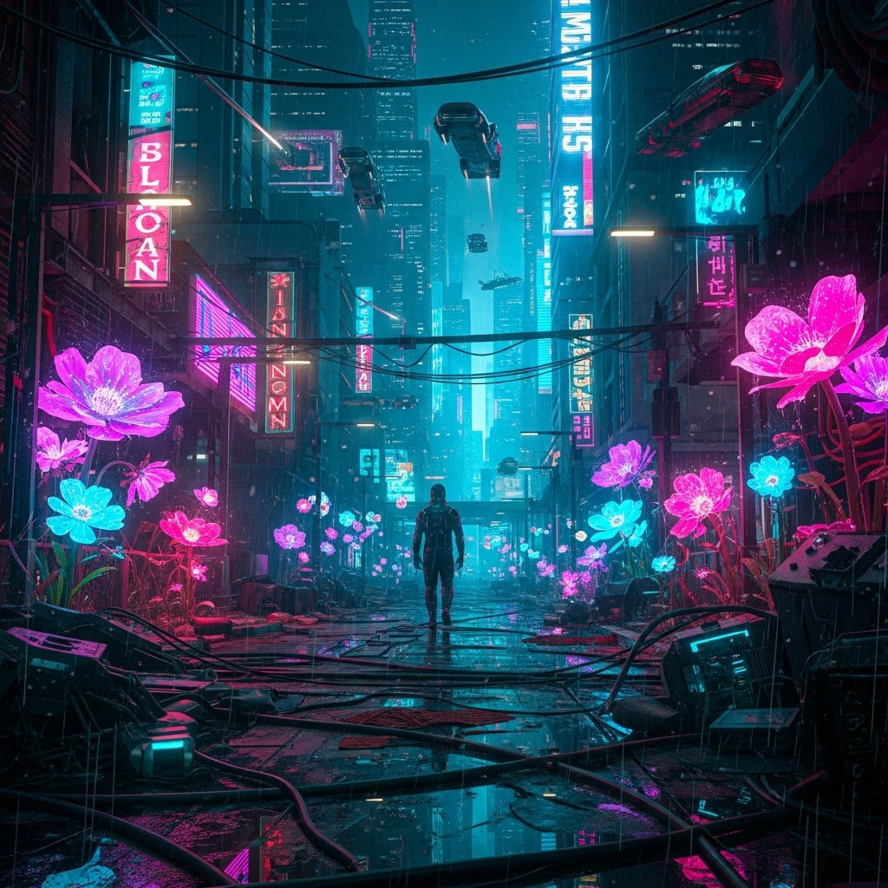

# 💫 About Me: Aspiring Full-Stack Developer

Hello! My name is Gabrielle H. A. Guimarães and I am an Aspiring Full-Stack Developer and Technologist in Cybersecurity and Cyber Defense Management. My current goal is to become a Cybercrime Investigator. Currently my main stack is JAVA. I'm looking to develop technology that helps law enforcement agencies prevent and investigate cybercrime I'm currently enrolled in the Generation Brasil Full-Stack Developer Bootcamp.

## 🌐 Socials:

  

# 💻 Tech Stack:

              

# 📊 GitHub Stats:

 
 

## 📌 &nbsp;Pinned Repositories

<table>
	<thead>
		<tr>
			<th colspan="2" width="2000">&nbsp;</th>
		</tr>
	</thead>
	<tbody>
		<tr>
			<td align="center" valign="top" width="80"> 
			
      </td>
			<td valign="top">
			<h3>Decodificador</h3>
			
Aplicação onde o usuário pode criptografar e descriptografar mensagens de forma simples e interativa.

			<a href="https://github.com/BIGBGIB/Decodificador">
			</td>
		</tr>
	</tbody>
</table>